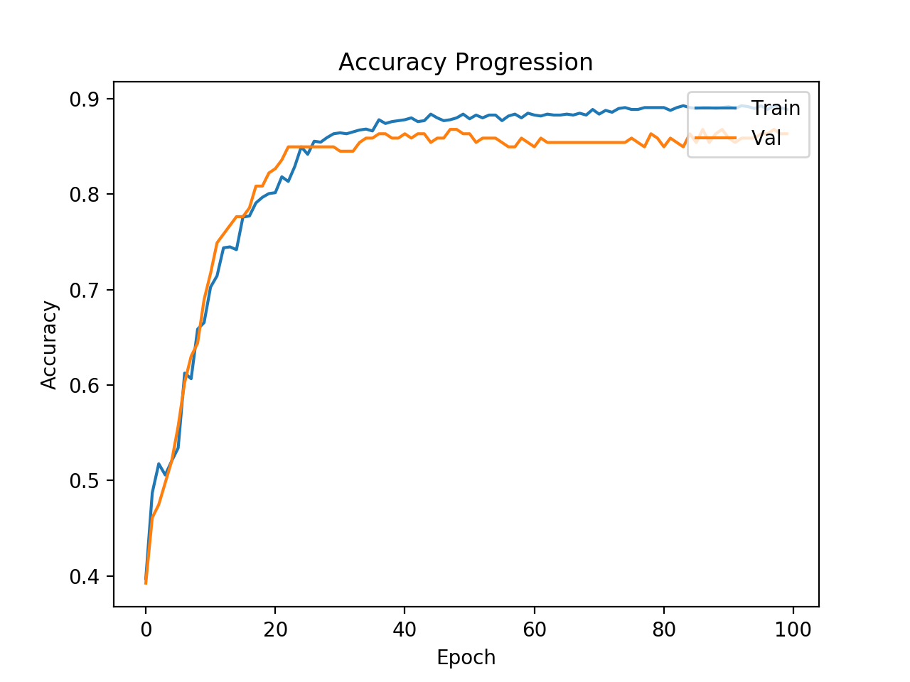
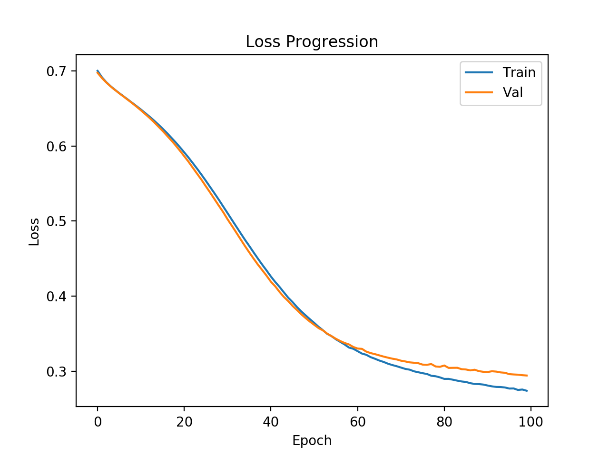
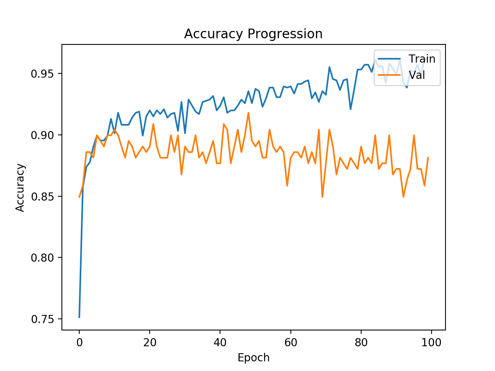
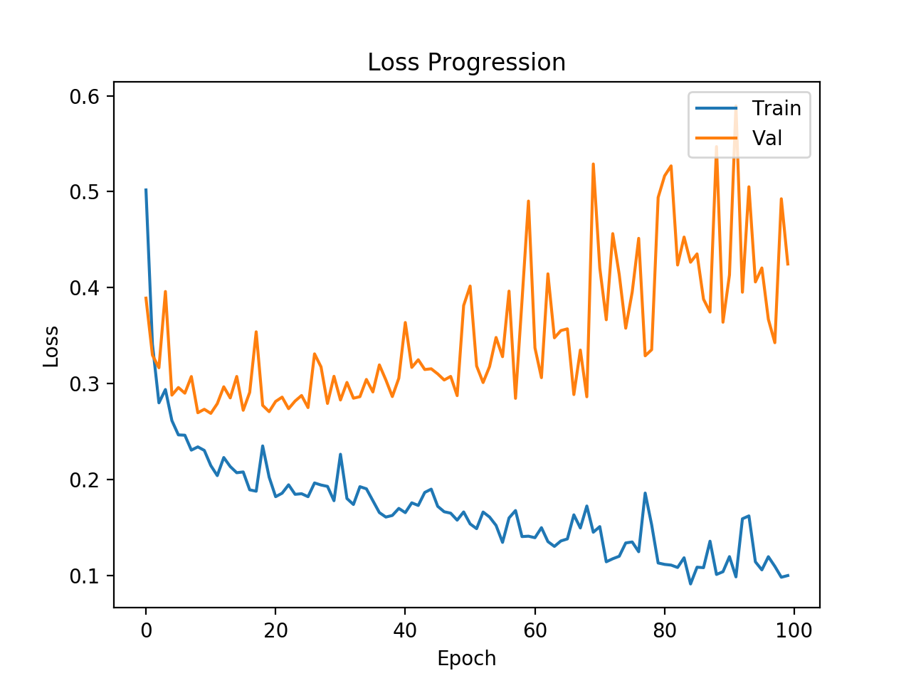
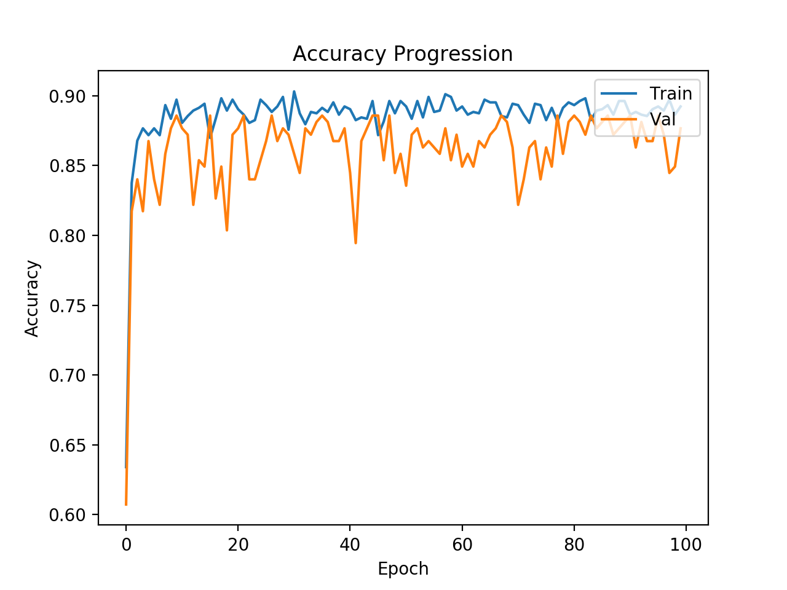
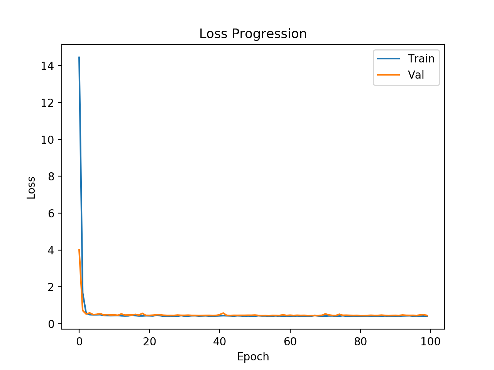

# Using a Neural Network to Predict Housing Price

Utilizing neural network to predict if a house is above or below its median price given a set of input features. This is mainly a reference to building simple neural networks for prediction. This also shows the importance of regularization and dropout when building a neural network. Concepts in this should be extrapolated into more complex models.

## Models

Three models were created to show the different effects of neural networks.

###  Model 1: Simple

This is a simple neural network of two fully-connected layers with 32 neurons each connected to an output layer. From testing the data, the following output was achieved.

From the distribution above, it is clear that the model performs decently as the validation data seems to follow the trend of the training data.

### Model 2: Overfitting

This model consists of 4 fully-connected layers with 1000 neurons each and connected to an output layer. From testing the data, the following output was achieved.

This is clearly a sign of overfitting as although the loss of the training data is decreasing, the validation data is still growing. This means that the model reduces the loss of the training data really well but doesn't represent "real" data well.

### Model 3: Regularization and Dropout

This model serves to fix the overfitting issue in the previous model. By adding L2 regularization and dropout probability, the following results were achieved.

This is a clear improvement upon the previous overfitted model. This shows that although having a large dense set of layers, you can still prevent overfitting by adding the appropriate amount of regularization techniques and introducing dropout.

## Acknowledgements
https://hackernoon.com/build-your-first-neural-network-to-predict-house-prices-with-keras-3fb0839680f4